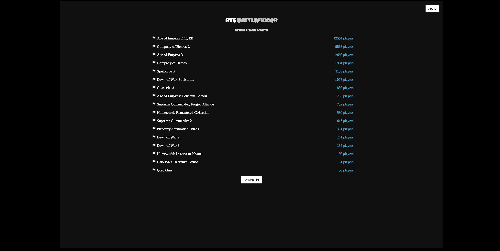

RTS BattleFinder

https://cswebd3v.github.io/RTSBattleFinder/

RTS BattleFinder is a tool that uses the Steam API to constantly track the playerbases of the most popular RTS (Real Time Strategy) games on Steam. It compiles these games into a list, and sorts the list by most to least active.

RTS BattleFinder was built using HTML&CSS, JavaScript and jQuery